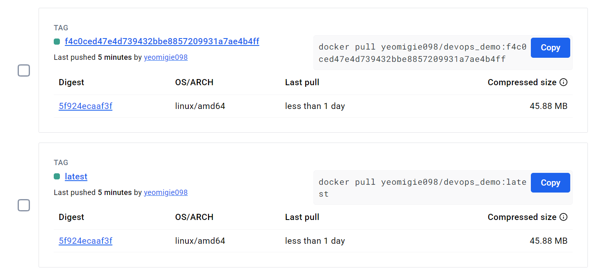

# DevOps Demo Homework

This project shows how to automatically test, build, and push a Python app to Docker Hub using GitHub Actions.

## What It Does
1. Runs tests when you push code
2. Builds a Docker image if tests pass
3. Pushes the image to Docker Hub

## DockerHub Screenshot

## How to Use
- Push code to GitHub
- Workflow will run automatically
- Go to your DockerHub to see the image
